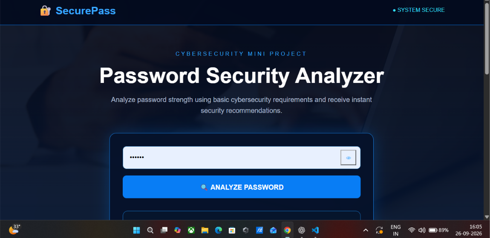

# 🔐 SecurePass - Password Strength Analyzer

SecurePass is a beginner-friendly cybersecurity web application that analyzes password strength and provides security recommendations.

## 🚀 Features

- Password strength analysis
- Security score out of 100
- Weak / Medium / Strong classification
- Uppercase and lowercase detection
- Number detection
- Special character detection
- Password length checking
- Common password detection
- Security recommendations
- Show / Hide password option
- Modern cybersecurity-themed interface
- Local password analysis
- Responsive design

## 🛠️ Technologies Used

- Python
- Flask
- HTML
- CSS
- JavaScript

## 📁 Project Structure

```text
SecurePass/
│
├── app.py
├── password_analyzer.py
├── requirements.txt
├── README.md
│
└── templates/
    └── index.html

## 📸 Demo
